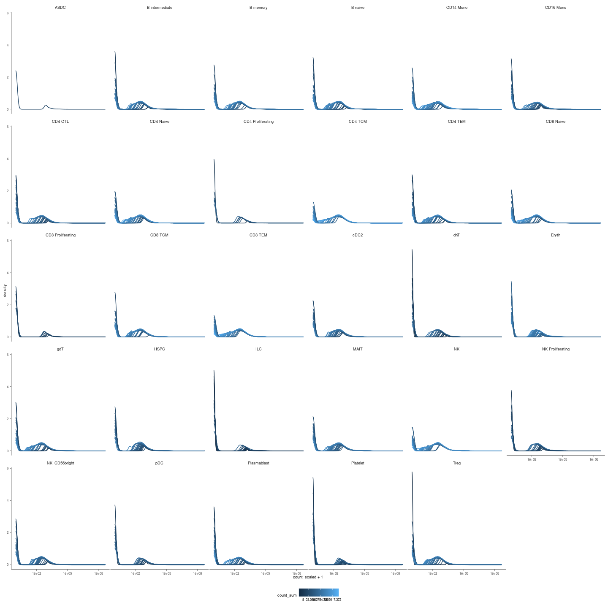
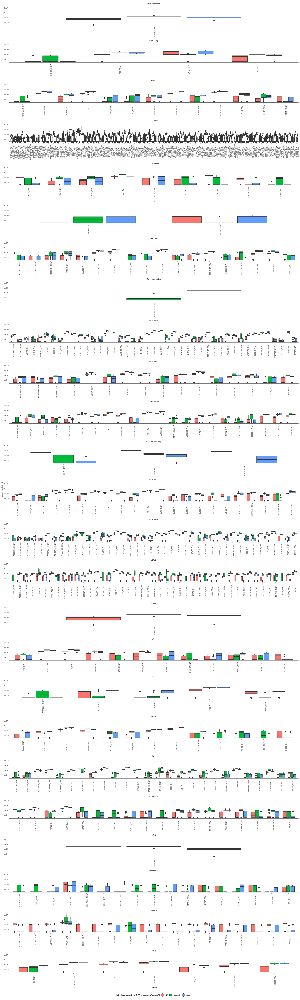
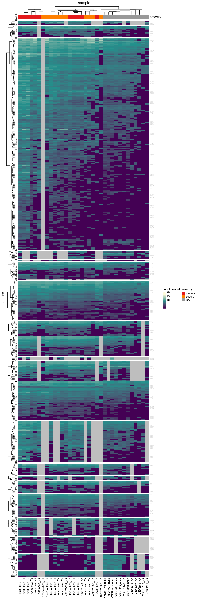

    plots_density = readRDS(here("data/3_prime_batch_1/fast_pipeline_results/differential_transcript_abundance/plot_densities.rds"))

Density plots to confirm that scaling for seqwuencing depth worked

    plots_density

    plots_de = readRDS(here("data/3_prime_batch_1/fast_pipeline_results/differential_transcript_abundance/plot_significant.rds"))

Box plots of the differentially abundant gene-transcripts healthy vs
moderate or moderate vs severe

Heatmap of the differentially abundant gene-transcripts healthy vs
moderate or moderate vs severe

    ## Loading required package: tidyHeatmap

    ## ========================================
    ## tidyHeatmap version 1.8.1
    ## If you use tidyHeatmap in published research, please cite:
    ## 1) Mangiola et al. tidyHeatmap: an R package for modular heatmap production 
    ##   based on tidy principles. JOSS 2020.
    ## 2) Gu, Z. Complex heatmaps reveal patterns and correlations in multidimensional 
    ##   genomic data. Bioinformatics 2016.
    ## This message can be suppressed by:
    ##   suppressPackageStartupMessages(library(tidyHeatmap))
    ## ========================================

    ## 
    ## Attaching package: 'tidyHeatmap'

    ## The following object is masked from 'package:stats':
    ## 
    ##     heatmap

The overlap in significant genes

    results_de = readRDS(here("data/3_prime_batch_1/fast_pipeline_results/differential_transcript_abundance/differential_transcript_abundance_output.rds"))

    results_de= results_de |> mutate(
        significant_genes_1 = map(
        se,
        ~ .x |> 
            filter(`FDR___severitymoderate-severityNA` < 0.05) |>
            distinct(.feature) |> 
            pull(.feature)
    ),
    significant_genes_2 = map(
        se,
        ~ .x |> 
            filter(`FDR___severitysevere-severitymoderate` < 0.05) |>
            distinct(.feature) |> 
            pull(.feature)
    )
    )

    ## tidySummarizedExperiment says: A data frame is returned for independent data analysis.
    ## tidySummarizedExperiment says: A data frame is returned for independent data analysis.
    ## tidySummarizedExperiment says: A data frame is returned for independent data analysis.
    ## tidySummarizedExperiment says: A data frame is returned for independent data analysis.
    ## tidySummarizedExperiment says: A data frame is returned for independent data analysis.
    ## tidySummarizedExperiment says: A data frame is returned for independent data analysis.
    ## tidySummarizedExperiment says: A data frame is returned for independent data analysis.
    ## tidySummarizedExperiment says: A data frame is returned for independent data analysis.
    ## tidySummarizedExperiment says: A data frame is returned for independent data analysis.
    ## tidySummarizedExperiment says: A data frame is returned for independent data analysis.
    ## tidySummarizedExperiment says: A data frame is returned for independent data analysis.
    ## tidySummarizedExperiment says: A data frame is returned for independent data analysis.

    ## tidySummarizedExperiment says: The resulting data frame is not rectangular (all genes for all samples), a tibble is returned for independent data analysis.

    ## tidySummarizedExperiment says: A data frame is returned for independent data analysis.
    ## tidySummarizedExperiment says: A data frame is returned for independent data analysis.
    ## tidySummarizedExperiment says: A data frame is returned for independent data analysis.

    ## tidySummarizedExperiment says: The resulting data frame is not rectangular (all genes for all samples), a tibble is returned for independent data analysis.

    ## tidySummarizedExperiment says: A data frame is returned for independent data analysis.
    ## tidySummarizedExperiment says: A data frame is returned for independent data analysis.

    ## tidySummarizedExperiment says: The resulting data frame is not rectangular (all genes for all samples), a tibble is returned for independent data analysis.

    ## tidySummarizedExperiment says: A data frame is returned for independent data analysis.

    ## tidySummarizedExperiment says: The resulting data frame is not rectangular (all genes for all samples), a tibble is returned for independent data analysis.
    ## tidySummarizedExperiment says: The resulting data frame is not rectangular (all genes for all samples), a tibble is returned for independent data analysis.

    ## tidySummarizedExperiment says: A data frame is returned for independent data analysis.
    ## tidySummarizedExperiment says: A data frame is returned for independent data analysis.

    ## tidySummarizedExperiment says: The resulting data frame is not rectangular (all genes for all samples), a tibble is returned for independent data analysis.

    ## tidySummarizedExperiment says: A data frame is returned for independent data analysis.
    ## tidySummarizedExperiment says: A data frame is returned for independent data analysis.

    ## tidySummarizedExperiment says: The resulting data frame is not rectangular (all genes for all samples), a tibble is returned for independent data analysis.
    ## tidySummarizedExperiment says: The resulting data frame is not rectangular (all genes for all samples), a tibble is returned for independent data analysis.

    ## tidySummarizedExperiment says: A data frame is returned for independent data analysis.
    ## tidySummarizedExperiment says: A data frame is returned for independent data analysis.

    ## tidySummarizedExperiment says: The resulting data frame is not rectangular (all genes for all samples), a tibble is returned for independent data analysis.

    ## tidySummarizedExperiment says: A data frame is returned for independent data analysis.
    ## tidySummarizedExperiment says: A data frame is returned for independent data analysis.

    ## tidySummarizedExperiment says: The resulting data frame is not rectangular (all genes for all samples), a tibble is returned for independent data analysis.

    ## tidySummarizedExperiment says: A data frame is returned for independent data analysis.
    ## tidySummarizedExperiment says: A data frame is returned for independent data analysis.

    ## tidySummarizedExperiment says: The resulting data frame is not rectangular (all genes for all samples), a tibble is returned for independent data analysis.
    ## tidySummarizedExperiment says: The resulting data frame is not rectangular (all genes for all samples), a tibble is returned for independent data analysis.
    ## tidySummarizedExperiment says: The resulting data frame is not rectangular (all genes for all samples), a tibble is returned for independent data analysis.
    ## tidySummarizedExperiment says: The resulting data frame is not rectangular (all genes for all samples), a tibble is returned for independent data analysis.

    ## tidySummarizedExperiment says: A data frame is returned for independent data analysis.
    ## tidySummarizedExperiment says: A data frame is returned for independent data analysis.

    ## tidySummarizedExperiment says: The resulting data frame is not rectangular (all genes for all samples), a tibble is returned for independent data analysis.

    ## tidySummarizedExperiment says: A data frame is returned for independent data analysis.

    ## tidySummarizedExperiment says: The resulting data frame is not rectangular (all genes for all samples), a tibble is returned for independent data analysis.
    ## tidySummarizedExperiment says: The resulting data frame is not rectangular (all genes for all samples), a tibble is returned for independent data analysis.

    ## tidySummarizedExperiment says: A data frame is returned for independent data analysis.
    ## tidySummarizedExperiment says: A data frame is returned for independent data analysis.
    ## tidySummarizedExperiment says: A data frame is returned for independent data analysis.

    ## tidySummarizedExperiment says: The resulting data frame is not rectangular (all genes for all samples), a tibble is returned for independent data analysis.

    ## tidySummarizedExperiment says: A data frame is returned for independent data analysis.
    ## tidySummarizedExperiment says: A data frame is returned for independent data analysis.

    ## tidySummarizedExperiment says: The resulting data frame is not rectangular (all genes for all samples), a tibble is returned for independent data analysis.

    ## tidySummarizedExperiment says: A data frame is returned for independent data analysis.

Common significant genes for the transition healthy moderate

    results_de |> 
        select(-se) |> 
        unnest(significant_genes_1) |> 
        tidybulk:::drop_class("tidySummarizedExperiment_nested") |>  
        select(-significant_genes_2) |> 
        nest(data = -significant_genes_1) |> 
        mutate(n = map_int(data, ~ nrow(.x))) |> 
        arrange(desc(n)) |>
        mutate(cell_types = map_chr(data, ~ .x |> pull(1) |> paste(collapse=", "))) |> 
      select(-data)

    ## # A tibble: 332 × 3
    ##    significant_genes_1     n cell_types                                         
    ##    <chr>               <int> <chr>                                              
    ##  1 FOS_RNA                18 B memory, B naive, CD14 Mono, CD16 Mono, CD4 Naive…
    ##  2 NR4A2_RNA              15 B intermediate, B memory, B naive, CD14 Mono, CD4 …
    ##  3 DUSP1_RNA              12 CD14 Mono, CD4 Naive, CD4 TCM, CD4 TEM, CD8 Naive,…
    ##  4 FOSB_RNA               11 CD14 Mono, CD16 Mono, CD4 TCM, CD4 TEM, CD8 Naive,…
    ##  5 PPP1R15A_RNA            9 CD14 Mono, CD4 Naive, CD4 TCM, CD8 Naive, CD8 TCM,…
    ##  6 AC004556.3_RNA          7 B memory, B naive, CD14 Mono, CD8 Naive, CD8 TEM, …
    ##  7 RGS1_RNA                7 CD4 TCM, CD4 TEM, CD8 TCM, CD8 TEM, cDC2, NK, NK_C…
    ##  8 AC020916.1_RNA          6 CD14 Mono, CD4 TCM, CD8 TCM, CD8 TEM, cDC2, NK     
    ##  9 AREG_RNA                6 CD14 Mono, CD4 Naive, CD4 TCM, CD8 Naive, CD8 TEM,…
    ## 10 SOCS3_RNA               6 CD14 Mono, CD4 Naive, CD4 TCM, CD8 Naive, cDC2, Tr…
    ## # … with 322 more rows

Common significant genes for the transition moderate severe

    results_de |> 
        select(-se) |> 
        unnest(significant_genes_2) |> 
        tidybulk:::drop_class("tidySummarizedExperiment_nested") |>  
        select(-significant_genes_1) |> 
        nest(data = -significant_genes_2) |> 
        mutate(n = map_int(data, ~ nrow(.x))) |> 
        arrange(desc(n)) |>
        mutate(cell_types = map_chr(data, ~ .x |> pull(1) |> paste(collapse=", "))) |> 
      select(-data)

    ## # A tibble: 71 × 3
    ##    significant_genes_2     n cell_types                            
    ##    <chr>               <int> <chr>                                 
    ##  1 SCGB3A1_RNA             4 CD4 Naive, CD4 TCM, CD8 Naive, CD8 TCM
    ##  2 KRT1_RNA                2 CD4 TCM, CD8 TCM                      
    ##  3 RGPD2_RNA               2 CD4 TCM, CD8 Naive                    
    ##  4 AC004556.3_RNA          2 CD8 Naive, Plasmablast                
    ##  5 ZFY_RNA                 2 NK_CD56bright, Plasmablast            
    ##  6 IGHE_RNA                1 B naive                               
    ##  7 KLRK1_RNA               1 B naive                               
    ##  8 CCL4L2_RNA              1 CD14 Mono                             
    ##  9 ZFAT_RNA                1 CD14 Mono                             
    ## 10 KIAA1324_RNA            1 CD4 Naive                             
    ## # … with 61 more rows
