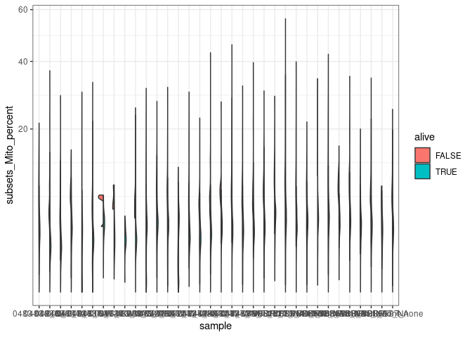
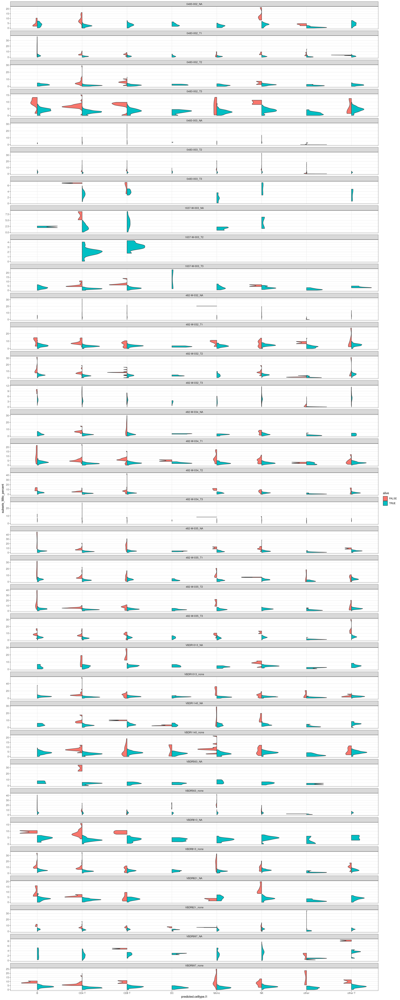
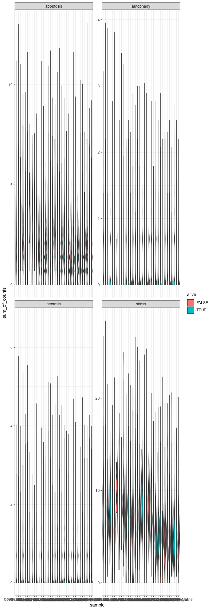
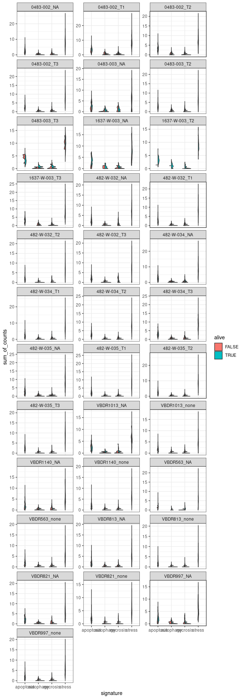
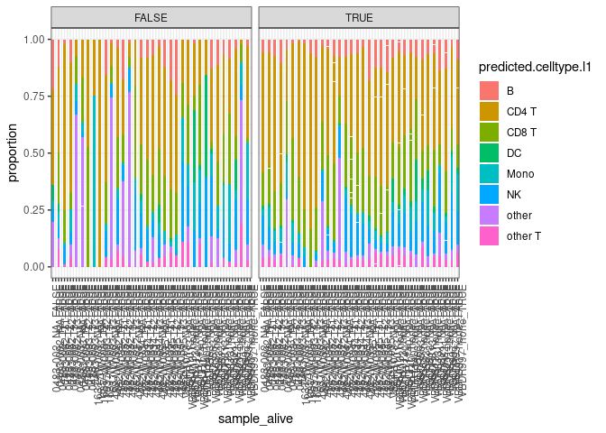
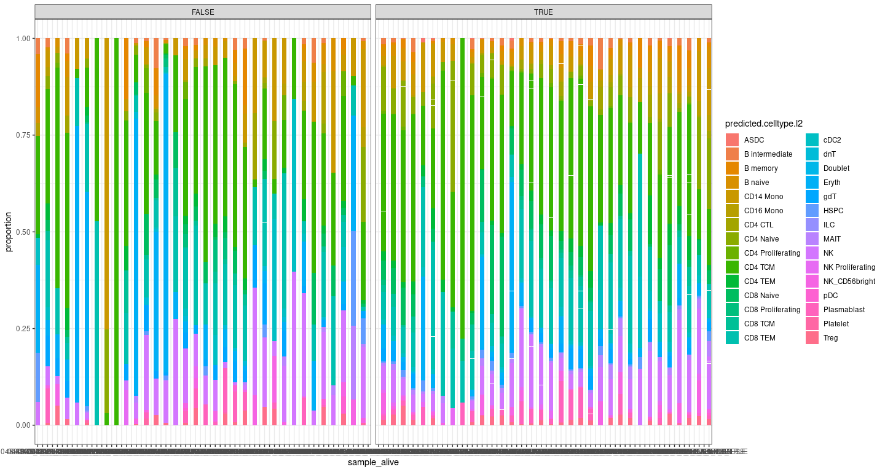
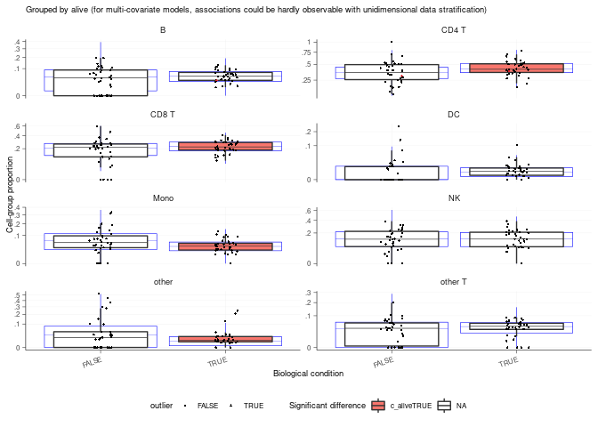
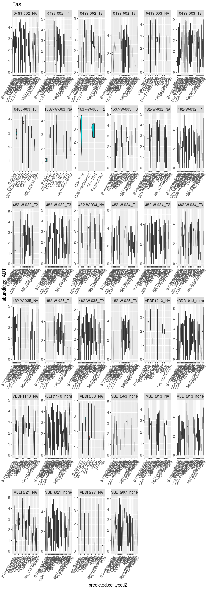
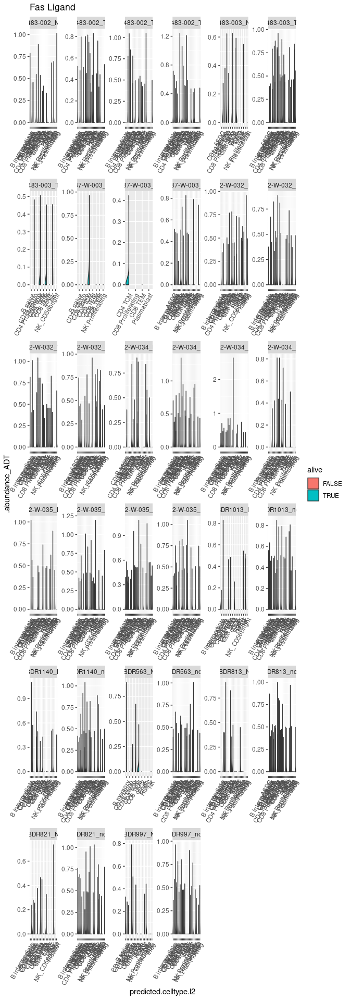
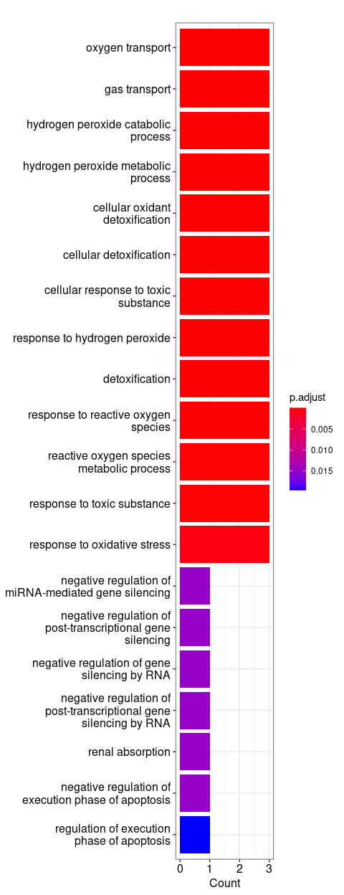

    library(Seurat)
    library(dplyr)
    library(SingleCellExperiment)
    library(cowplot)
    library(sccomp)
    library(ggplot2)
    library(patchwork)
    library(introdataviz)
    library(clusterProfiler)
    library(AnnotationDbi)
    library(org.Hs.eg.db)
    library(dittoSeq)
    library(tidyseurat)
    library(tidyr)
    library(tidyverse)
    library(tidySingleCellExperiment)
    library(tidysc)

## Loading all samples & define alive/dead

    #select directory
    files <- dir("/stornext/Bioinf/data/bioinf-data/Papenfuss_lab/projects/roestie/roestielisa/PBMC/data/3_prime_batch_1/preprocessing_results/non_batch_variation_removal/", full.name = T)
    #combine count dataframe by rows using seurat function merge
    merged_combined <- 
      files |>
      map(readRDS) |>
      purrr::reduce(merge)

    merged_combined #98,626 × 16

    ## # A Seurat-tibble abstraction: 81,090 × 21
    ## # Features=36601 | Cells=81090 | Active assay=SCT | Assays=HTO, ADT, RNA, SCT
    ##    .cell      orig.…¹ barcode sample Total LogProb  PValue Limited   FDR empty…²
    ##    <chr>      <chr>   <chr>   <chr>  <int>   <dbl>   <dbl> <lgl>   <dbl> <lgl>  
    ##  1 1_AAACGAA… 1       AAACGA… 0483-…  2713  -5119. 1.00e-4 TRUE        0 FALSE  
    ##  2 1_AACCTTT… 1       AACCTT… 0483-…  2308  -5369. 1.00e-4 TRUE        0 FALSE  
    ##  3 1_AATGACC… 1       AATGAC… 0483-…  4030  -7027. 1.00e-4 TRUE        0 FALSE  
    ##  4 1_AATGCCA… 1       AATGCC… 0483-…  6121  -9019. 1.00e-4 TRUE        0 FALSE  
    ##  5 1_AATGCCA… 1       AATGCC… 0483-…  3071  -5482. 1.00e-4 TRUE        0 FALSE  
    ##  6 1_ACATTTC… 1       ACATTT… 0483-…  4442  -7718. 1.00e-4 TRUE        0 FALSE  
    ##  7 1_ACCTACC… 1       ACCTAC… 0483-…  2523  -4545. 1.00e-4 TRUE        0 FALSE  
    ##  8 1_ACCTGTC… 1       ACCTGT… 0483-…  2860  -5300. 1.00e-4 TRUE        0 FALSE  
    ##  9 1_ACCTGTC… 1       ACCTGT… 0483-… 12112 -15251. 1.00e-4 TRUE        0 FALSE  
    ## 10 1_ACGGAAG… 1       ACGGAA… 0483-…  4857  -8071. 1.00e-4 TRUE        0 FALSE  
    ## # … with 81,080 more rows, 11 more variables: rank <dbl>, total <int>,
    ## #   fitted <dbl>, knee <dbl>, inflection <dbl>, nCount_ADT <dbl>,
    ## #   nFeature_ADT <int>, nCount_RNA <dbl>, nFeature_RNA <int>, nCount_SCT <dbl>,
    ## #   nFeature_SCT <int>, and abbreviated variable names ¹​orig.ident,
    ## #   ²​empty_droplet
    ## # ℹ Use `print(n = ...)` to see more rows, and `colnames()` to see all variable names

    #loading, merging and left_join
    files_annotation <- dir("/stornext/Bioinf/data/bioinf-data/Papenfuss_lab/projects/roestie/roestielisa/PBMC/data/3_prime_batch_1/preprocessing_results/annotation_label_transfer/", full.name = T)
    files_alive_identification <- dir("/stornext/Bioinf/data/bioinf-data/Papenfuss_lab/projects/roestie/roestielisa/PBMC/data/3_prime_batch_1/preprocessing_results/alive_identification", full.name = T)

    #load merge and join:
    merged_combined_annotation_alive <- #after annotation 98,626 × 20, after alive: 98,626 × 29
      
      #join annotation
      merged_combined |>
      left_join(
        files_annotation |>
          map(readRDS) |>
          purrr::reduce(bind_rows), by=".cell") |>
      #join alive identification
      left_join(
        files_alive_identification |>
          map(readRDS) |>
          purrr::reduce(bind_rows), by = c(".cell", "predicted.celltype.l1", "refUMAP_1", "refUMAP_2"))

    merged_combined_annotation_alive %>% select(sample) %>% table()

    ## tidyseurat says: Key columns are missing. A data frame is returned for independent data analysis.

    ## sample
    ##   0483-002_NA   0483-002_T1   0483-002_T2   0483-002_T3   0483-003_NA 
    ##          1206          3411          1261          4083           170 
    ##   0483-003_T2   0483-003_T3 1637-W-003_NA 1637-W-003_T2 1637-W-003_T3 
    ##          9306           109            67            54          1277 
    ##  482-W-032_NA  482-W-032_T1  482-W-032_T2  482-W-032_T3  482-W-034_NA 
    ##          1145          3924          4193          2200           952 
    ##  482-W-034_T1  482-W-034_T2  482-W-034_T3  482-W-035_NA  482-W-035_T1 
    ##          6413          3527          1385          1234          4101 
    ##  482-W-035_T2  482-W-035_T3   VBDR1013_NA VBDR1013_none   VBDR1140_NA 
    ##          4656          4550           150          3825           516 
    ## VBDR1140_none    VBDR563_NA  VBDR563_none    VBDR813_NA  VBDR813_none 
    ##          4655            70          1689           350          4496 
    ##    VBDR821_NA  VBDR821_none    VBDR997_NA  VBDR997_none 
    ##           340          3496           196          2083

    ## alive
    ## FALSE  TRUE 
    ##  2011 79079

### Identity ?

## Plot 1 - Visualisation of Mitochondria content

### For each sample

    #original ggplot
    merged_combined_annotation_alive |>
      
      #violin plot
      ggplot(aes(x=sample, y=subsets_Mito_percent, fill=alive)) + 
      introdataviz::geom_split_violin() +
      scale_y_sqrt() +
      theme(axis.text.x=element_text(angle=70, hjust=1)) +
      theme_bw()

    ## Warning: Groups with fewer than two data points have been dropped.

### For each sample according to cell type

    #facet by sample, x= celltypes
    merged_combined_annotation_alive |>
      
      #violin plot
      ggplot(aes(x=predicted.celltype.l1, y=subsets_Mito_percent, fill=alive)) + 
      introdataviz::geom_split_violin() +
      facet_wrap(~sample, scale="free_y", ncol =1) +
      theme(axis.text.x=element_text(angle=70, hjust=1)) +
      theme_bw()

    ## Warning: Groups with fewer than two data points have been dropped.
    ## Groups with fewer than two data points have been dropped.
    ## Groups with fewer than two data points have been dropped.
    ## Groups with fewer than two data points have been dropped.
    ## Groups with fewer than two data points have been dropped.
    ## Groups with fewer than two data points have been dropped.
    ## Groups with fewer than two data points have been dropped.
    ## Groups with fewer than two data points have been dropped.
    ## Groups with fewer than two data points have been dropped.
    ## Groups with fewer than two data points have been dropped.
    ## Groups with fewer than two data points have been dropped.
    ## Groups with fewer than two data points have been dropped.
    ## Groups with fewer than two data points have been dropped.
    ## Groups with fewer than two data points have been dropped.
    ## Groups with fewer than two data points have been dropped.
    ## Groups with fewer than two data points have been dropped.
    ## Groups with fewer than two data points have been dropped.
    ## Groups with fewer than two data points have been dropped.
    ## Groups with fewer than two data points have been dropped.
    ## Groups with fewer than two data points have been dropped.
    ## Groups with fewer than two data points have been dropped.
    ## Groups with fewer than two data points have been dropped.
    ## Groups with fewer than two data points have been dropped.
    ## Groups with fewer than two data points have been dropped.
    ## Groups with fewer than two data points have been dropped.
    ## Groups with fewer than two data points have been dropped.
    ## Groups with fewer than two data points have been dropped.
    ## Groups with fewer than two data points have been dropped.
    ## Groups with fewer than two data points have been dropped.
    ## Groups with fewer than two data points have been dropped.
    ## Groups with fewer than two data points have been dropped.
    ## Groups with fewer than two data points have been dropped.
    ## Groups with fewer than two data points have been dropped.
    ## Groups with fewer than two data points have been dropped.
    ## Groups with fewer than two data points have been dropped.
    ## Groups with fewer than two data points have been dropped.
    ## Groups with fewer than two data points have been dropped.
    ## Groups with fewer than two data points have been dropped.
    ## Groups with fewer than two data points have been dropped.
    ## Groups with fewer than two data points have been dropped.
    ## Groups with fewer than two data points have been dropped.
    ## Groups with fewer than two data points have been dropped.
    ## Groups with fewer than two data points have been dropped.
    ## Groups with fewer than two data points have been dropped.
    ## Groups with fewer than two data points have been dropped.
    ## Groups with fewer than two data points have been dropped.
    ## Groups with fewer than two data points have been dropped.

## Plot 2 - Visualisation of apoptosis, necrosis, autophagy and stress markers

    # selecting stress markers - splitting the markers for better visualisation
    stress_markers <- c("JUN", "FOS", "IL6", "TNF", "CXCR4", "SNAI1", "VIM", "GADD45B", "MCL1","STAT1", "IRF7", "IRF3", "IRF1", "CDKN2A", "TP53", "MRTFB", "RBL1", "NUPR1", "IFNG", "IFNB1", "IFNA2", "IFNL1", "IFNA1", "IFNK", "TNF", "IL-12")

    #selecting death markers
    apoptosis_markers <- c("BCL2L1", "CASP9", "CHP2", "CYCS", "EXOG", "IL1A", "IL1R1", "IL1RAP", "IL3RA", "PIK3CA", "PIK3CD", "PIK3CG", "PIK3R1", "PIK3R2", "PRKAR1B", "NFKBIA", "TNFRSF10A", "TNFRSF10B", "TNFRSF10D", "TNFRSF1A")
    necrosis_markers = c("DNML1", "GSDME", "IPMK", "MLKL", "RBCK1", "TICAM1", "YBX3")
    autophagy_markers = c("ATG12", "GABARAPL1", "IFNA17", "IFNA8")

    #first drop the MT gene from the nCount_SCT :
    mitochondrial_genes = grep("^MT-", rownames(merged_combined_annotation_alive[["SCT"]]),value = T)
    ribosomal_genes = grep("^RP(S|L)", rownames(merged_combined_annotation_alive[["SCT"]]), value = T)

    #remove the gene from the matrix #dim before 98,626 × 29.     98,626 × 29
    merged_combined_annotation_alive_no_MT_no_rib <-
      merged_combined_annotation_alive[! rownames(merged_combined_annotation_alive) %in% mitochondrial_genes, ]

    merged_combined_annotation_alive_no_MT_no_rib <-
      merged_combined_annotation_alive_no_MT_no_rib[! rownames(merged_combined_annotation_alive_no_MT_no_rib) %in% ribosomal_genes, ]

    #re-scaling, see github
    all.genes <- rownames(merged_combined_annotation_alive_no_MT_no_rib)
    head(all.genes)

    ## [1] "MIR1302-2HG" "FAM138A"     "OR4F5"       "AL627309.1"  "AL627309.3" 
    ## [6] "AL627309.2"

    merged_combined_annotation_alive_no_MT_no_rib<- ScaleData(merged_combined_annotation_alive_no_MT_no_rib, assay = "SCT", slot='scale.data', features = all.genes)

    ## Warning: The following arguments are not used: slot

    ## Centering and scaling data matrix

    # Creating gene signatures:

    # 1 create a gene signature + genes in the signature dataframe:
    #stress
    stress_markers_df <- as.data.frame(stress_markers)
    stress_markers_df$signature <- "stress"
    colnames(stress_markers_df)[1] <- ".feature"

    apoptosis_markers_df <- as.data.frame(apoptosis_markers)
    apoptosis_markers_df$signature <- "apoptosis"
    colnames(apoptosis_markers_df)[1] <- ".feature"

    necrosis_markers_df <- as.data.frame(necrosis_markers)
    necrosis_markers_df$signature <- "necrosis"
    colnames(necrosis_markers_df)[1] <- ".feature"

    autophagy_markers_df <- as.data.frame(autophagy_markers)
    autophagy_markers_df$signature <- "autophagy"
    colnames(autophagy_markers_df)[1] <- ".feature"

    #bind by rows, obtain only 1 dataframe with all the signatures
    gene_signatures <- rbind(stress_markers_df, apoptosis_markers_df, necrosis_markers_df, autophagy_markers_df)

    #combine the new dataframe with my seurat object:
    #join seurat object with signature dataframe, option long, bind by col created = .features
    merged_combined_annotation_alive_no_MT_no_rib_signature <-
    merged_combined_annotation_alive_no_MT_no_rib |>
      join_features(
        features = c(stress_markers, apoptosis_markers, necrosis_markers, autophagy_markers),
        shape="long") |>
      left_join(gene_signatures, by = ".feature")

    ## tidyseurat says: This operation lead to duplicated cell names. A data frame is returned for independent data analysis.

    #Plot 1 - facet by gene signatures
    merged_combined_annotation_alive_no_MT_no_rib_signature |>
      group_by(.cell, signature, alive, sample) |>
      mutate(sum_of_counts = sum(.abundance_SCT)) |>
    #create the ggplot facet by gene signatures
      ggplot(aes(x=sample, y=sum_of_counts, fill=alive)) + 
      introdataviz::geom_split_violin() +
      facet_wrap(~signature,  scale="free_y" ) + #ncol=1
      theme(axis.text.x=element_text(angle=70, hjust=1)) +
      theme_bw()

    #Plot 2 - facet by samples
    #create the column sum of counts
    merged_combined_annotation_alive_no_MT_no_rib_signature |>
      group_by(.cell, signature, alive, sample) |>
      mutate(sum_of_counts = sum(.abundance_SCT)) |>

    #create the ggplot facet by samples
      ggplot(aes(x=signature, y=sum_of_counts, fill=alive)) + 
      introdataviz::geom_split_violin() +
      facet_wrap(~sample, scale="free_y", ncol=3) + #ncol=1
      theme(axis.text.x=element_text(angle=70, hjust=1)) +
      theme_bw()

## Plot 3 - Composition of cells

    ## # A tibble: 280 × 9
    ##    predicted.c…¹ param…² covar…³ c_lower c_eff…⁴ c_upper  c_pH0   c_FDR count_…⁵
    ##    <chr>         <chr>   <chr>     <dbl>   <dbl>   <dbl>  <dbl>   <dbl> <list>  
    ##  1 B             (Inter… <NA>    -6.91     2.70    9.83  0.312  0.0612  <tibble>
    ##  2 B             aliveT… alive    0.0625   0.233   0.420 0.343  0.0802  <tibble>
    ##  3 B             sample… sample  -0.312    0.182   0.571 0.534  0.174   <tibble>
    ##  4 B             sample… sample   0.123    0.706   1.24  0.0398 0.0276  <tibble>
    ##  5 B             sample… sample   0.296    0.821   1.24  0.0125 0.00561 <tibble>
    ##  6 B             sample… sample  -3.06    -1.09    0.461 0.134  0.0380  <tibble>
    ##  7 B             sample… sample  -5.76    -1.26   -0.748 0      0       <tibble>
    ##  8 B             sample… sample  -3.21    -0.455   1.77  0.420  0.121   <tibble>
    ##  9 B             sample… sample  -0.820    1.45    3.90  0.157  0.0622  <tibble>
    ## 10 B             sample… sample  -0.555    2.90    6.83  0.0503 0.0168  <tibble>
    ## # … with 270 more rows, and abbreviated variable names ¹​predicted.celltype.l1,
    ## #   ²​parameter, ³​covariate, ⁴​c_effect, ⁵​count_data
    ## # ℹ Use `print(n = ...)` to see more rows

    ## [[1]]

## Plot 4 - Check marker for activation induced cell death (Fas/CD95 - FasL/CD95L)

## Plot 5 - Gene Ontology genes analysis

    ## [1] "TRUE"  "FALSE"

### Gene Ontology: Alive cells

    ##                p_val avg_log2FC pct.1 pct.2     p_val_adj
    ## EEF1B2 6.651244e-112  0.5293706 0.978 0.879 2.426706e-107
    ## CCL4    5.375004e-11  0.5896806 0.231 0.172  1.961070e-06

### Gene Ontology: Dead cells

    ##                   p_val avg_log2FC pct.1 pct.2     p_val_adj
    ## MTRNR2L12 2.903314e-107   1.063250 0.605 0.433 1.059274e-102
    ## HBB        9.882595e-48   2.254668 0.943 0.935  3.605665e-43
    ## NEAT1      1.189364e-33   1.175224 0.709 0.658  4.339393e-29
    ## HBA2       2.424764e-29   2.132526 0.604 0.549  8.846751e-25
    ## HBA1       1.009746e-20   2.130741 0.408 0.351  3.684059e-16

