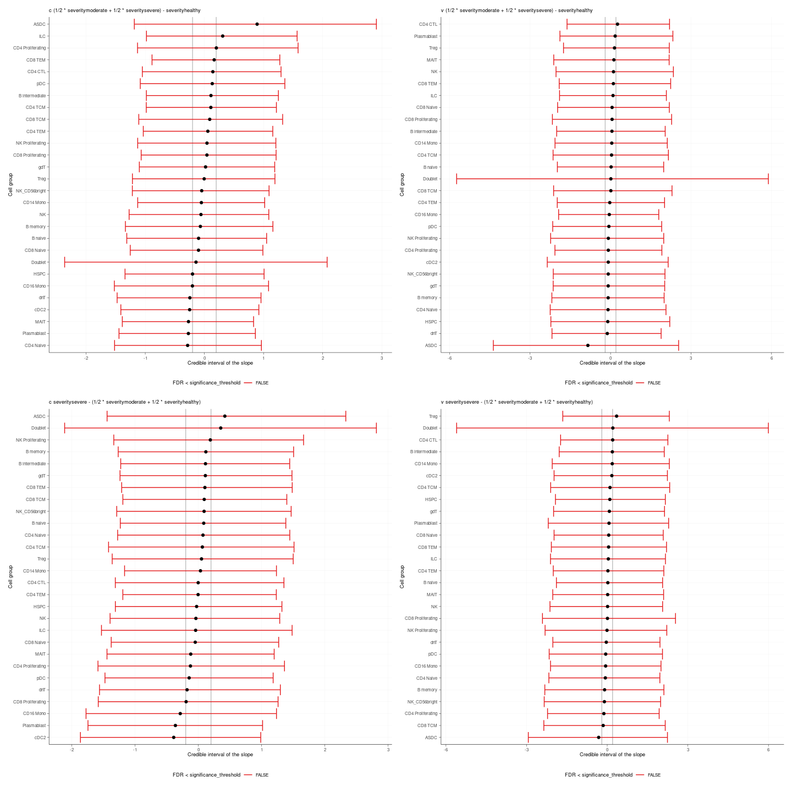
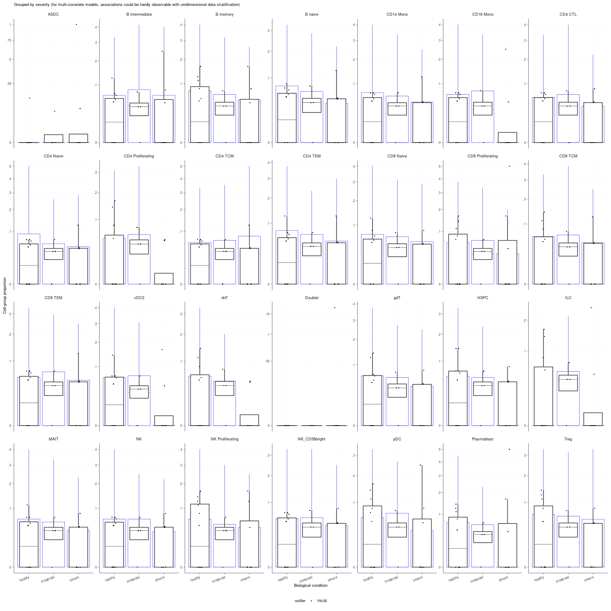
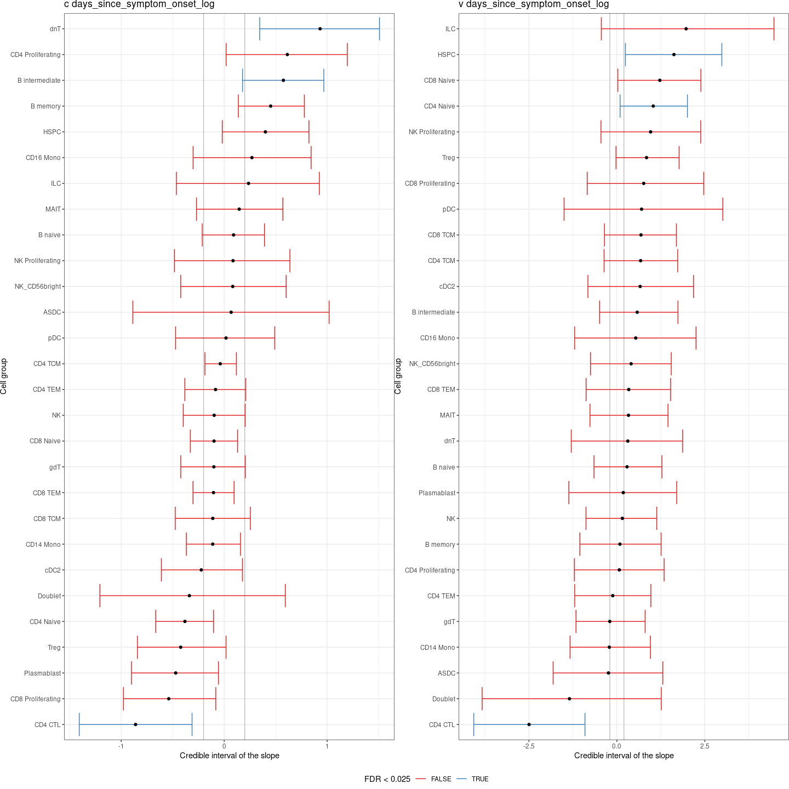
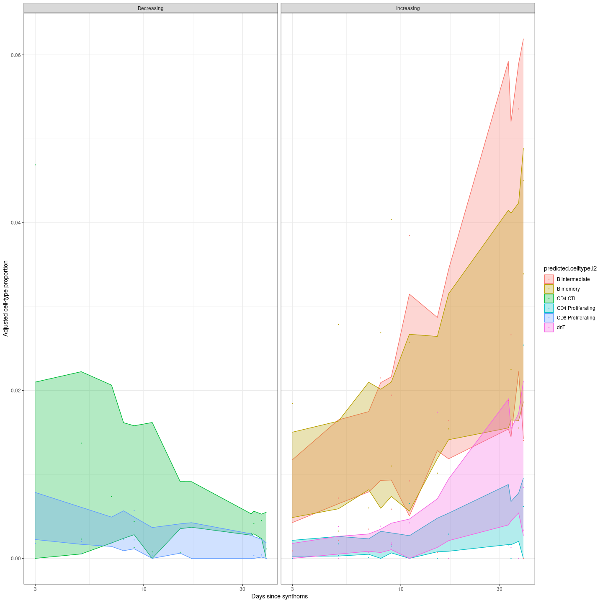

    plot_credible_intervals <- readRDS(here("data/3_prime_batch_1/fast_pipeline_results/differential_composition/plot_credible_intervals.rds"))

    plot_credible_intervals[[1]]$credible_intervals_1D

    plot_credible_intervals[[1]]$boxplot[[1]] +
    guides(fill=guide_legend(nrow=4,byrow=TRUE))

    ## Warning: Removed 1512 rows containing non-finite values (stat_summary).

Testing evolution of blood composition during time

COVID Atlas - <https://atlas.fredhutch.org/fredhutch/covid/>

    atlas_composition = readRDS(here("data/covid_atlas/plot_composition_analysis.rds"))

    knitr::include_graphics(here("data/covid_atlas/plot_atlas.pdf"))

