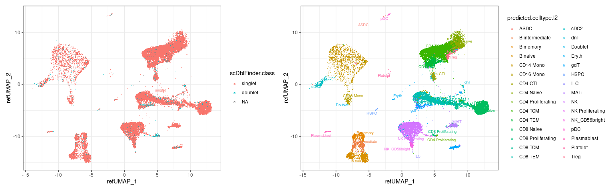
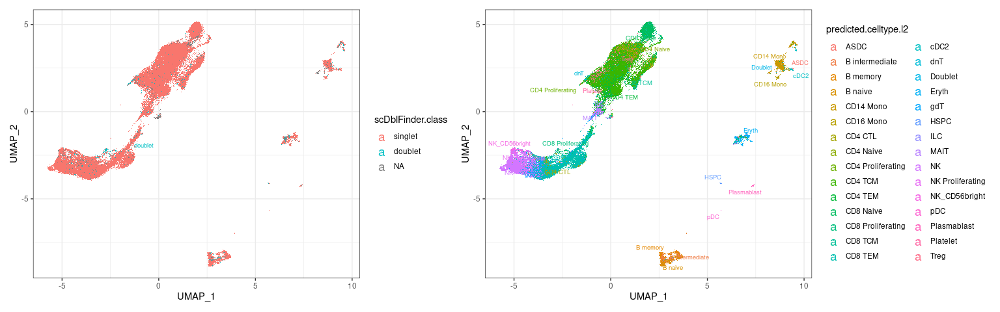
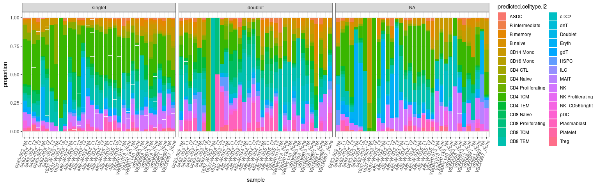
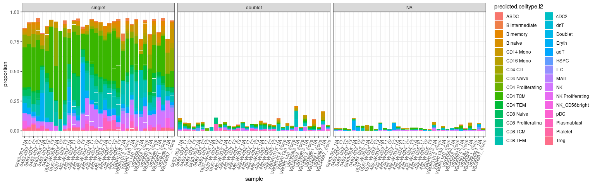

    ## Modularity Optimizer version 1.3.0 by Ludo Waltman and Nees Jan van Eck
    ## 
    ## Number of nodes: 81090
    ## Number of edges: 2268360
    ## 
    ## Running Louvain algorithm...
    ## Maximum modularity in 10 random starts: 0.9125
    ## Number of communities: 22
    ## Elapsed time: 35 seconds

    ##                scDblFinder.class
    ## sample          singlet doublet
    ##   0483-002_NA      1114      61
    ##   0483-002_T1      3225     118
    ##   0483-002_T2      1189      38
    ##   0483-002_T3      3952      75
    ##   0483-003_NA       148       4
    ##   0483-003_T2      8637     363
    ##   0483-003_T3       103       1
    ##   1637-W-003_NA      63       1
    ##   1637-W-003_T2      51       2
    ##   1637-W-003_T3    1220      32
    ##   482-W-032_NA     1038      44
    ##   482-W-032_T1     3751      91
    ##   482-W-032_T2     4048      77
    ##   482-W-032_T3     2017      74
    ##   482-W-034_NA      876      38
    ##   482-W-034_T1     6157     123
    ##   482-W-034_T2     3370      92
    ##   482-W-034_T3     1319      36
    ##   482-W-035_NA     1133      53
    ##   482-W-035_T1     3873     128
    ##   482-W-035_T2     4437     132
    ##   482-W-035_T3     4389      96
    ##   VBDR1013_NA       128       9
    ##   VBDR1013_none    3666      67
    ##   VBDR1140_NA       478      16
    ##   VBDR1140_none    4472      97
    ##   VBDR563_NA         58       8
    ##   VBDR563_none     1588      27
    ##   VBDR813_NA        305      23
    ##   VBDR813_none     4291      95
    ##   VBDR821_NA        299      16
    ##   VBDR821_none     3384      58
    ##   VBDR997_NA        169      17
    ##   VBDR997_none     1969      50

    ##                scDblFinder.class
    ## sample          singlet doublet
    ##   0483-002_NA      1114      61
    ##   0483-002_T1      3225     118
    ##   0483-002_T2      1189      38
    ##   0483-002_T3      3952      75
    ##   0483-003_NA       148       4
    ##   0483-003_T2      8637     363
    ##   0483-003_T3       103       1
    ##   1637-W-003_NA      63       1
    ##   1637-W-003_T2      51       2
    ##   1637-W-003_T3    1220      32
    ##   482-W-032_NA     1038      44
    ##   482-W-032_T1     3751      91
    ##   482-W-032_T2     4048      77
    ##   482-W-032_T3     2017      74
    ##   482-W-034_NA      876      38
    ##   482-W-034_T1     6157     123
    ##   482-W-034_T2     3370      92
    ##   482-W-034_T3     1319      36
    ##   482-W-035_NA     1133      53
    ##   482-W-035_T1     3873     128
    ##   482-W-035_T2     4437     132
    ##   482-W-035_T3     4389      96
    ##   VBDR1013_NA       128       9
    ##   VBDR1013_none    3666      67
    ##   VBDR1140_NA       478      16
    ##   VBDR1140_none    4472      97
    ##   VBDR563_NA         58       8
    ##   VBDR563_none     1588      27
    ##   VBDR813_NA        305      23
    ##   VBDR813_none     4291      95
    ##   VBDR821_NA        299      16
    ##   VBDR821_none     3384      58
    ##   VBDR997_NA        169      17
    ##   VBDR997_none     1969      50

