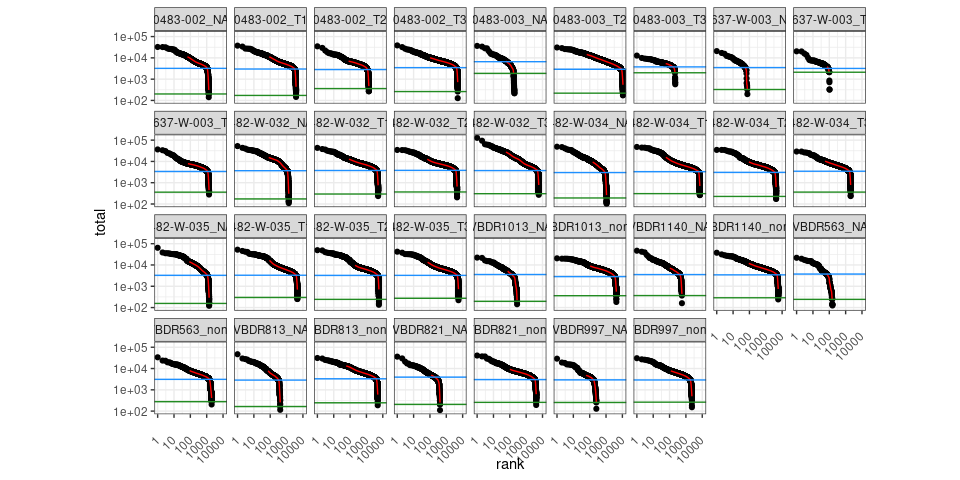
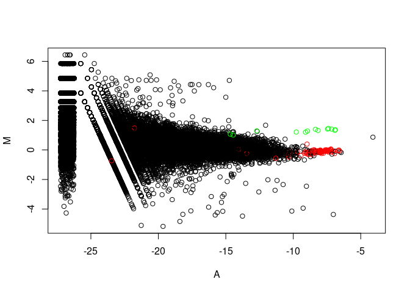
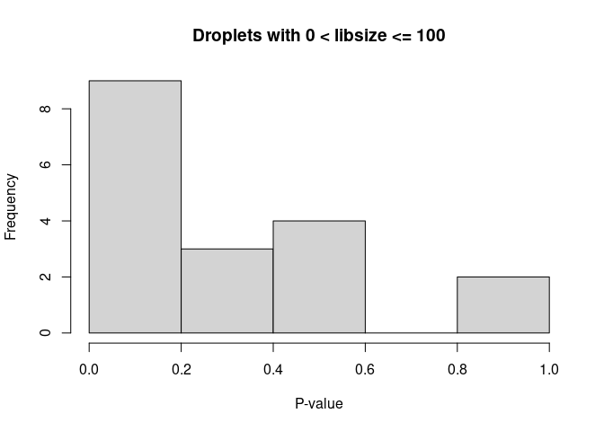

Visualize barcode rank plots for each sample

    test <- demultiplexed_empty_joined %>%  filter(demultiplexed_empty_joined$FDR < 0.001) %>% select(FDR, empty_droplet)

    ## tidyseurat says: Key columns are missing. A data frame is returned for independent data analysis.

    test |> select(empty_droplet) |> table()

    ## empty_droplet
    ## FALSE 
    ## 81090

Number of non-empty droplets, everything above knee is retained.

    ##    Mode   FALSE    TRUE    NA's 
    ## logical    8429   81090    9215

    ## is.cell
    ## FALSE  TRUE 
    ##  8429 81090

Check if p-values are lower-bounded by ‘niters’ (increase ‘niters’ if
any Limited==TRUE and Sig==FALSE), with niters being: An integer scalar
specifying the number of iterations to use for the Monte Carlo p-value
calculations.

    ##        Limited
    ## Sig     FALSE  TRUE
    ##   FALSE  8429     0
    ##   TRUE  22814 58276

MA plot

(mitochondria genes in green, ribosomal genes in red)

Histogram of p-values:

