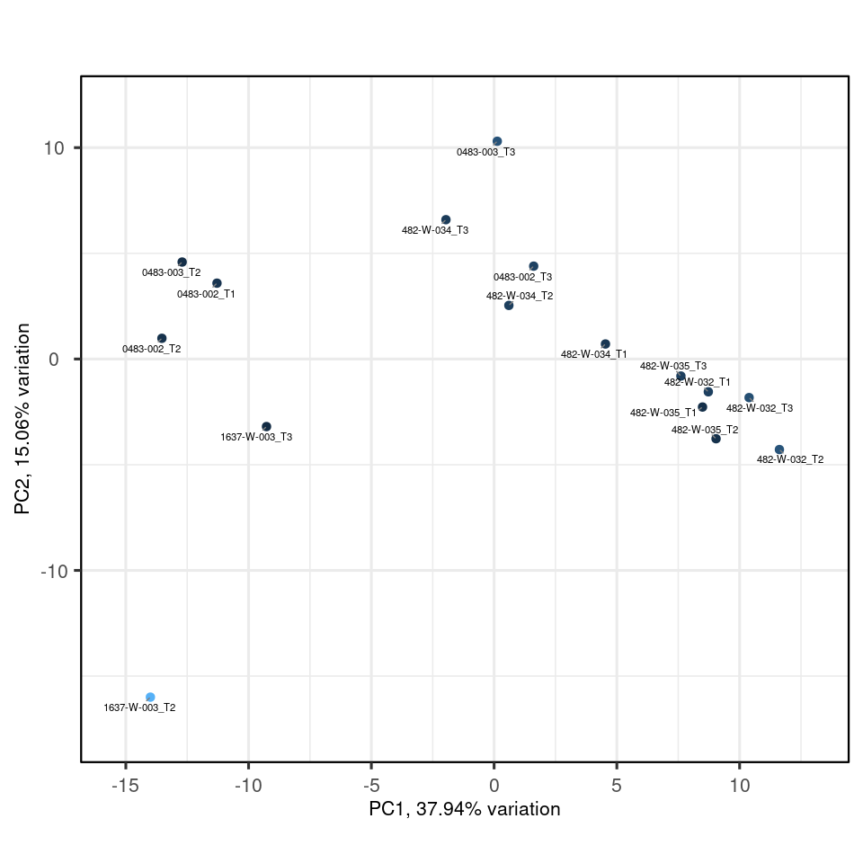

    # Load data
    pseudobulk = 
        here("data/3_prime_batch_1/preprocessing_results/pseudobulk_preprocessing/pseudobulk_preprocessing_sample_output.rds") |> 
      readRDS()

# Analysis for RNA

Here to check that the input counts have not global sequencing-depth
effect

    data_for_pca |> 
      ggplot(aes(count_scaled + 1, color=.sample)) + geom_density() + scale_x_log10()

Calculate PCA of pseudobulk

    metadata = 
      data_for_pca |> 
      pivot_sample() |>
      select(.sample, donor, simple_timepoint, severity, days_since_symptom_onset, COVID, TMM) 

    metadata = as.data.frame(metadata) 
    rownames(metadata) = metadata$`.sample`
    metadata = metadata[,-1]

    my_pca = 
      data_for_pca@assays@data$count_scaled |> 
      log1p() |> 
      scale() |> 
      pca(metadata = metadata) 

Calculate explained variance of principal components. This gives an idea
of how many principal components we need to represent the data
faithfully. In this case we see a gradual decrease of variance
explained, indicating that we might need up to principal component 20
for explaining 90% of the variance.

    my_pca |> screeplot()

Here we see which variable is associated with which principal component.
We hope the biological variable are associated with the top principal
components.

= indeed we see COVID and severity associated with the first principal
component, COVID and days since symptom onset associated with the second
principal component, and TMM associated with the third principal
component together with simple time points. These gifts as hope that the
biological effects have large magnitude.

    my_pca |> 
      eigencorplot(metavars = colnames(metadata))

    ## Warning in eigencorplot(my_pca, metavars = colnames(metadata)): donor is not
    ## numeric - please check the source data as non-numeric variables will be coerced
    ## to numeric

    ## Warning in eigencorplot(my_pca, metavars = colnames(metadata)): simple_timepoint
    ## is not numeric - please check the source data as non-numeric variables will be
    ## coerced to numeric

    ## Warning in eigencorplot(my_pca, metavars = colnames(metadata)): severity is not
    ## numeric - please check the source data as non-numeric variables will be coerced
    ## to numeric

    ## Warning in eigencorplot(my_pca, metavars = colnames(metadata)): COVID is not
    ## numeric - please check the source data as non-numeric variables will be coerced
    ## to numeric

Here we see for the distribution of samples coloured by severity along
the top principal components.

    my_pca$rotated |> 
      cbind(my_pca$metadata) |> 
      as_tibble(rownames = ".sample") |> 
      GGally::ggpairs(columns = 2:15, ggplot2::aes(colour=`severity`))

    ## Registered S3 method overwritten by 'GGally':
    ##   method from   
    ##   +.gg   ggplot2

Here we see for the distribution of samples coloured by
days\_since\_symptom\_onset along the top principal components.

    metadata_with_days = 
      metadata |> 
      filter(!is.na(days_since_symptom_onset))

    data_for_pca_days = 
      data_for_pca |> 
      filter(!is.na(days_since_symptom_onset))

    my_pca_days = 
      filter(data_for_pca_days, !is.na(days_since_symptom_onset))@assays@data$count_scaled |> 
      log1p() |> 
      scale() |> 
      pca(metadata = metadata_with_days) 

    my_pca_days$rotated |> 
      cbind(my_pca_days$metadata) |> 
      as_tibble(rownames = ".sample") |> 
      mutate(days_since_symptom_onset = if_else(days_since_symptom_onset>median(days_since_symptom_onset), "late", "early")) |>  
      GGally::ggpairs(columns = 2:15, ggplot2::aes(colour=`days_since_symptom_onset`))

    my_pca_days |> 
      eigencorplot(metavars = colnames(metadata_with_days |> select(-COVID)))

    ## Warning in eigencorplot(my_pca_days, metavars =
    ## colnames(select(metadata_with_days, : donor is not numeric - please check the
    ## source data as non-numeric variables will be coerced to numeric

    ## Warning in eigencorplot(my_pca_days, metavars =
    ## colnames(select(metadata_with_days, : simple_timepoint is not numeric - please
    ## check the source data as non-numeric variables will be coerced to numeric

    ## Warning in eigencorplot(my_pca_days, metavars =
    ## colnames(select(metadata_with_days, : severity is not numeric - please check the
    ## source data as non-numeric variables will be coerced to numeric

    my_pca_days |> 
      biplot(colby="TMM")

    my_pca_days |> 
      biplot(colby="donor")

# Analysis of antibodies

Here to check that the input counts have not global sequencing-depth
effect

    data_for_pca |> 
      ggplot(aes(count_scaled + 1, color=.sample)) + geom_density() + scale_x_log10()

Calculate PCA of pseudobulk

    metadata = 
      data_for_pca |> 
      pivot_sample() |>
      select(.sample, donor, simple_timepoint, severity, days_since_symptom_onset, COVID, TMM) |> 
      replace_na(replace = list(days_since_symptom_onset = 0)) 

    metadata = as.data.frame(metadata) 
    rownames(metadata) = metadata$`.sample`
    metadata = metadata[,-1]

    my_pca = 
      data_for_pca@assays@data$count_scaled |> 
      log1p() |> 
      scale() |> 
      pca(metadata = metadata) 

Calculate explained variance of principal components. This gives an idea
of how many principal components we need to represent the data
faithfully. In this case we see a gradual decrease of variance
explained, indicating that we might need up to printipal component 20
for explaining 90% of the variance.

    my_pca |> screeplot()

Here we see which variable is associated with which principal component.
We hope the biological variable are associated with the top principal
components.

= indeed we see COVID and severity associated with the first principal
component, COVID and days since symptom onset associated with the second
principal component, and TMM associated with the third principal
component together with simple time points. These gifts as hope that the
biological effects have large magnitude.

    my_pca |> 
      eigencorplot(metavars = colnames(metadata))

    ## Warning in eigencorplot(my_pca, metavars = colnames(metadata)): donor is not
    ## numeric - please check the source data as non-numeric variables will be coerced
    ## to numeric

    ## Warning in eigencorplot(my_pca, metavars = colnames(metadata)): simple_timepoint
    ## is not numeric - please check the source data as non-numeric variables will be
    ## coerced to numeric

    ## Warning in eigencorplot(my_pca, metavars = colnames(metadata)): severity is not
    ## numeric - please check the source data as non-numeric variables will be coerced
    ## to numeric

    ## Warning in eigencorplot(my_pca, metavars = colnames(metadata)): COVID is not
    ## numeric - please check the source data as non-numeric variables will be coerced
    ## to numeric

Here we see for the distribution of samples coloused by severity along
the top principal components.

    my_pca$rotated |> 
      cbind(my_pca$metadata) |> 
      as_tibble(rownames = ".sample") |> 
      GGally::ggpairs(columns = 2:15, ggplot2::aes(colour=`severity`))

Here we see for the distribution of samples coloused by
days\_since\_symptom\_onset along the top principal components.

    my_pca$rotated |> 
      cbind(my_pca$metadata) |> 
      as_tibble(rownames = ".sample") |> 
      mutate(days_since_symptom_onset = if_else(days_since_symptom_onset>median(days_since_symptom_onset), "late", "early")) |>  
      GGally::ggpairs(columns = 2:15, ggplot2::aes(colour=`days_since_symptom_onset`))

    my_pca |> 
      biplot(colby="TMM")

    my_pca |> 
      biplot(colby="donor")

# Analysis of covariate redundancy

    metadata

    ##                    donor simple_timepoint severity days_since_symptom_onset
    ## 0483-002_NA     0483-002               NA moderate                        0
    ## 0483-002_T1     0483-002               T1 moderate                        5
    ## 0483-002_T2     0483-002               T2 moderate                        8
    ## 0483-002_T3     0483-002               T3 moderate                       34
    ## 0483-003_NA     0483-003               NA moderate                        0
    ## 0483-003_T2     0483-003               T2 moderate                        7
    ## 0483-003_T3     0483-003               T3 moderate                       39
    ## 1637-W-003_NA 1637-W-003               NA   severe                        0
    ## 1637-W-003_T2 1637-W-003               T2   severe                       11
    ## 1637-W-003_T3 1637-W-003               T3   severe                       17
    ## 482-W-032_NA   482-W-032               NA   severe                        0
    ## 482-W-032_T1   482-W-032               T1   severe                       33
    ## 482-W-032_T2   482-W-032               T2   severe                       37
    ## 482-W-032_T3   482-W-032               T3   severe                       39
    ## 482-W-034_NA   482-W-034               NA   severe                        0
    ## 482-W-034_T1   482-W-034               T1   severe                        9
    ## 482-W-034_T2   482-W-034               T2   severe                       11
    ## 482-W-034_T3   482-W-034               T3   severe                       15
    ## 482-W-035_NA   482-W-035               NA moderate                        0
    ## 482-W-035_T1   482-W-035               T1 moderate                        3
    ## 482-W-035_T2   482-W-035               T2 moderate                        5
    ## 482-W-035_T3   482-W-035               T3 moderate                        9
    ## VBDR1013_NA     VBDR1013               NA       NA                        0
    ## VBDR1013_none   VBDR1013             none       NA                        0
    ## VBDR1140_NA     VBDR1140               NA       NA                        0
    ## VBDR1140_none   VBDR1140             none       NA                        0
    ## VBDR563_NA       VBDR563               NA       NA                        0
    ## VBDR563_none     VBDR563             none       NA                        0
    ## VBDR813_NA       VBDR813               NA       NA                        0
    ## VBDR813_none     VBDR813             none       NA                        0
    ## VBDR821_NA       VBDR821               NA       NA                        0
    ## VBDR821_none     VBDR821             none       NA                        0
    ## VBDR997_NA       VBDR997               NA       NA                        0
    ## VBDR997_none     VBDR997             none       NA                        0
    ##               COVID       TMM
    ## 0483-002_NA    TRUE 1.0074424
    ## 0483-002_T1    TRUE 1.0255025
    ## 0483-002_T2    TRUE 1.0156813
    ## 0483-002_T3    TRUE 1.0106802
    ## 0483-003_NA    TRUE 0.7986725
    ## 0483-003_T2    TRUE 1.0774194
    ## 0483-003_T3    TRUE 0.8916291
    ## 1637-W-003_NA  TRUE 0.7399618
    ## 1637-W-003_T2  TRUE 0.8664717
    ## 1637-W-003_T3  TRUE 1.0360248
    ## 482-W-032_NA   TRUE 0.9160799
    ## 482-W-032_T1   TRUE 1.0076738
    ## 482-W-032_T2   TRUE 1.0242726
    ## 482-W-032_T3   TRUE 1.0082499
    ## 482-W-034_NA   TRUE 0.8628639
    ## 482-W-034_T1   TRUE 0.9733934
    ## 482-W-034_T2   TRUE 1.0188914
    ## 482-W-034_T3   TRUE 1.0121775
    ## 482-W-035_NA   TRUE 0.9916354
    ## 482-W-035_T1   TRUE 1.0499111
    ## 482-W-035_T2   TRUE 1.1296713
    ## 482-W-035_T3   TRUE 1.0691957
    ## VBDR1013_NA   FALSE 1.1674736
    ## VBDR1013_none FALSE 1.1313864
    ## VBDR1140_NA   FALSE 1.1174852
    ## VBDR1140_none FALSE 1.0329846
    ## VBDR563_NA    FALSE 1.0694319
    ## VBDR563_none  FALSE 1.0488852
    ## VBDR813_NA    FALSE 1.0065996
    ## VBDR813_none  FALSE 1.1475235
    ## VBDR821_NA    FALSE 0.9507530
    ## VBDR821_none  FALSE 1.0278402
    ## VBDR997_NA    FALSE 0.8730673
    ## VBDR997_none  FALSE 1.0570607

    require(tidyverse)
    require(rcompanion)

    ## Loading required package: rcompanion

    require(corrr)

    ## Loading required package: corrr

    ## 
    ## Attaching package: 'corrr'

    ## The following object is masked from 'package:tidybulk':
    ## 
    ##     as_matrix

    # Calculate a pairwise association between all variables in a data-frame. In particular nominal vs nominal with Chi-square, numeric vs numeric with Pearson correlation, and nominal vs numeric with ANOVA.
    # Adopted from https://stackoverflow.com/a/52557631/590437
    mixed_assoc = function(df, cor_method="spearman", adjust_cramersv_bias=TRUE){
      
      # https://stackoverflow.com/questions/52554336/plot-the-equivalent-of-correlation-matrix-for-factors-categorical-data-and-mi
      
        df_comb = expand.grid(names(df), names(df),  stringsAsFactors = F) %>% set_names(c("X1", "X2"))

        is_nominal = function(x) class(x) %in% c("factor", "character")
        # https://community.rstudio.com/t/why-is-purr-is-numeric-deprecated/3559
        # https://github.com/r-lib/rlang/issues/781
        is_numeric <- function(x) { is.integer(x) || is_double(x)}

        f = function(xName,yName) { 
            x =  pull(df, xName)
            y =  pull(df, yName)

            result = if(is_nominal(x) && is_nominal(y)){
                # use bias corrected cramersV as described in https://rdrr.io/cran/rcompanion/man/cramerV.html
                cv = cramerV(as.character(x), as.character(y), bias.correct = adjust_cramersv_bias)
                data.frame(xName, yName, assoc=cv, type="cramersV")

            }else if(is_numeric(x) && is_numeric(y)){
                correlation = cor(x, y, method=cor_method, use="complete.obs")
                data.frame(xName, yName, assoc=correlation, type="correlation")

            }else if(is_numeric(x) && is_nominal(y)){
                # from https://stats.stackexchange.com/questions/119835/correlation-between-a-nominal-iv-and-a-continuous-dv-variable/124618#124618
                r_squared = summary(lm(x ~ y))$r.squared
                data.frame(xName, yName, assoc=sqrt(r_squared), type="anova")

            }else if(is_nominal(x) && is_numeric(y)){
                r_squared = summary(lm(y ~x))$r.squared
                data.frame(xName, yName, assoc=sqrt(r_squared), type="anova")

            }else {
                warning(paste("unmatched column type combination: ", class(x), class(y)))
              return(NULL)
            }

            # finally add complete obs number and ratio to table
            result %>% mutate(complete_obs_pairs=sum(!is.na(x) & !is.na(y)), complete_obs_ratio=complete_obs_pairs/length(x)) %>% rename(x=xName, y=yName)
        }

        # apply function to each variable combination
        map2_df(df_comb$X1, df_comb$X2, f)
    }

    mixed_assoc(metadata)

    ## Warning in .f(.x[[i]], .y[[i]], ...): unmatched column type combination: logical
    ## factor

    ## Warning in .f(.x[[i]], .y[[i]], ...): unmatched column type combination: logical
    ## factor

    ## Warning in .f(.x[[i]], .y[[i]], ...): unmatched column type combination: logical
    ## factor

    ## Warning in .f(.x[[i]], .y[[i]], ...): unmatched column type combination: logical
    ## numeric

    ## Warning in .f(.x[[i]], .y[[i]], ...): unmatched column type combination: factor
    ## logical

    ## Warning in .f(.x[[i]], .y[[i]], ...): unmatched column type combination: factor
    ## logical

    ## Warning in .f(.x[[i]], .y[[i]], ...): unmatched column type combination: factor
    ## logical

    ## Warning in .f(.x[[i]], .y[[i]], ...): unmatched column type combination: numeric
    ## logical

    ## Warning in .f(.x[[i]], .y[[i]], ...): unmatched column type combination: logical
    ## logical

    ## Warning in .f(.x[[i]], .y[[i]], ...): unmatched column type combination: numeric
    ## logical

    ## Warning in .f(.x[[i]], .y[[i]], ...): unmatched column type combination: logical
    ## numeric

    ##                                      x                        y       assoc
    ## Cramer V...1                     donor                    donor  1.00000000
    ## Cramer V...2          simple_timepoint                    donor  0.00000000
    ## Cramer V...3                  severity                    donor  0.84240000
    ## ...4          days_since_symptom_onset                    donor  0.68386487
    ## ...5                               TMM                    donor  0.71400293
    ## Cramer V...6                     donor         simple_timepoint  0.00000000
    ## Cramer V...7          simple_timepoint         simple_timepoint  1.00000000
    ## Cramer V...8                  severity         simple_timepoint  0.44450000
    ## ...9          days_since_symptom_onset         simple_timepoint  0.77262321
    ## ...10                              TMM         simple_timepoint  0.42901040
    ## Cramer V...11                    donor                 severity  0.84240000
    ## Cramer V...12         simple_timepoint                 severity  0.44450000
    ## Cramer V...13                 severity                 severity  1.00000000
    ## ...14         days_since_symptom_onset                 severity  0.51794104
    ## ...15                              TMM                 severity  0.43571360
    ## ...16                            donor days_since_symptom_onset  0.68386487
    ## ...17                 simple_timepoint days_since_symptom_onset  0.77262321
    ## ...18                         severity days_since_symptom_onset  0.51794104
    ## ...19         days_since_symptom_onset days_since_symptom_onset  1.00000000
    ## ...20                              TMM days_since_symptom_onset -0.07103901
    ## ...21                            donor                      TMM  0.71400293
    ## ...22                 simple_timepoint                      TMM  0.42901040
    ## ...23                         severity                      TMM  0.43571360
    ## ...24         days_since_symptom_onset                      TMM -0.07103901
    ## ...25                              TMM                      TMM  1.00000000
    ##                      type complete_obs_pairs complete_obs_ratio
    ## Cramer V...1     cramersV                 34                  1
    ## Cramer V...2     cramersV                 34                  1
    ## Cramer V...3     cramersV                 34                  1
    ## ...4                anova                 34                  1
    ## ...5                anova                 34                  1
    ## Cramer V...6     cramersV                 34                  1
    ## Cramer V...7     cramersV                 34                  1
    ## Cramer V...8     cramersV                 34                  1
    ## ...9                anova                 34                  1
    ## ...10               anova                 34                  1
    ## Cramer V...11    cramersV                 34                  1
    ## Cramer V...12    cramersV                 34                  1
    ## Cramer V...13    cramersV                 34                  1
    ## ...14               anova                 34                  1
    ## ...15               anova                 34                  1
    ## ...16               anova                 34                  1
    ## ...17               anova                 34                  1
    ## ...18               anova                 34                  1
    ## ...19         correlation                 34                  1
    ## ...20         correlation                 34                  1
    ## ...21               anova                 34                  1
    ## ...22               anova                 34                  1
    ## ...23               anova                 34                  1
    ## ...24         correlation                 34                  1
    ## ...25         correlation                 34                  1

Heatmap of correlation

    metadata %>%
        mixed_assoc() %>%
      mutate(assoc = round(assoc, 3)) |>  
        select(x, y, assoc) %>%
      ggplot(aes(x,y,fill=assoc))+
      geom_tile()+
      geom_text(aes(x,y,label=assoc))+ 
      scale_fill_gradient2() +
      theme_classic()

    ## Warning in .f(.x[[i]], .y[[i]], ...): unmatched column type combination: logical
    ## factor

    ## Warning in .f(.x[[i]], .y[[i]], ...): unmatched column type combination: logical
    ## factor

    ## Warning in .f(.x[[i]], .y[[i]], ...): unmatched column type combination: logical
    ## factor

    ## Warning in .f(.x[[i]], .y[[i]], ...): unmatched column type combination: logical
    ## numeric

    ## Warning in .f(.x[[i]], .y[[i]], ...): unmatched column type combination: factor
    ## logical

    ## Warning in .f(.x[[i]], .y[[i]], ...): unmatched column type combination: factor
    ## logical

    ## Warning in .f(.x[[i]], .y[[i]], ...): unmatched column type combination: factor
    ## logical

    ## Warning in .f(.x[[i]], .y[[i]], ...): unmatched column type combination: numeric
    ## logical

    ## Warning in .f(.x[[i]], .y[[i]], ...): unmatched column type combination: logical
    ## logical

    ## Warning in .f(.x[[i]], .y[[i]], ...): unmatched column type combination: numeric
    ## logical

    ## Warning in .f(.x[[i]], .y[[i]], ...): unmatched column type combination: logical
    ## numeric

Pair plot, all vs all.

    GGally::ggpairs(metadata, aes(color = severity)) + theme_bw()

    ## `stat_bin()` using `bins = 30`. Pick better value with `binwidth`.
    ## `stat_bin()` using `bins = 30`. Pick better value with `binwidth`.
    ## `stat_bin()` using `bins = 30`. Pick better value with `binwidth`.

    ## Warning in cor(x, y): the standard deviation is zero

    ## `stat_bin()` using `bins = 30`. Pick better value with `binwidth`.
    ## `stat_bin()` using `bins = 30`. Pick better value with `binwidth`.
    ## `stat_bin()` using `bins = 30`. Pick better value with `binwidth`.
    ## `stat_bin()` using `bins = 30`. Pick better value with `binwidth`.
    ## `stat_bin()` using `bins = 30`. Pick better value with `binwidth`.

