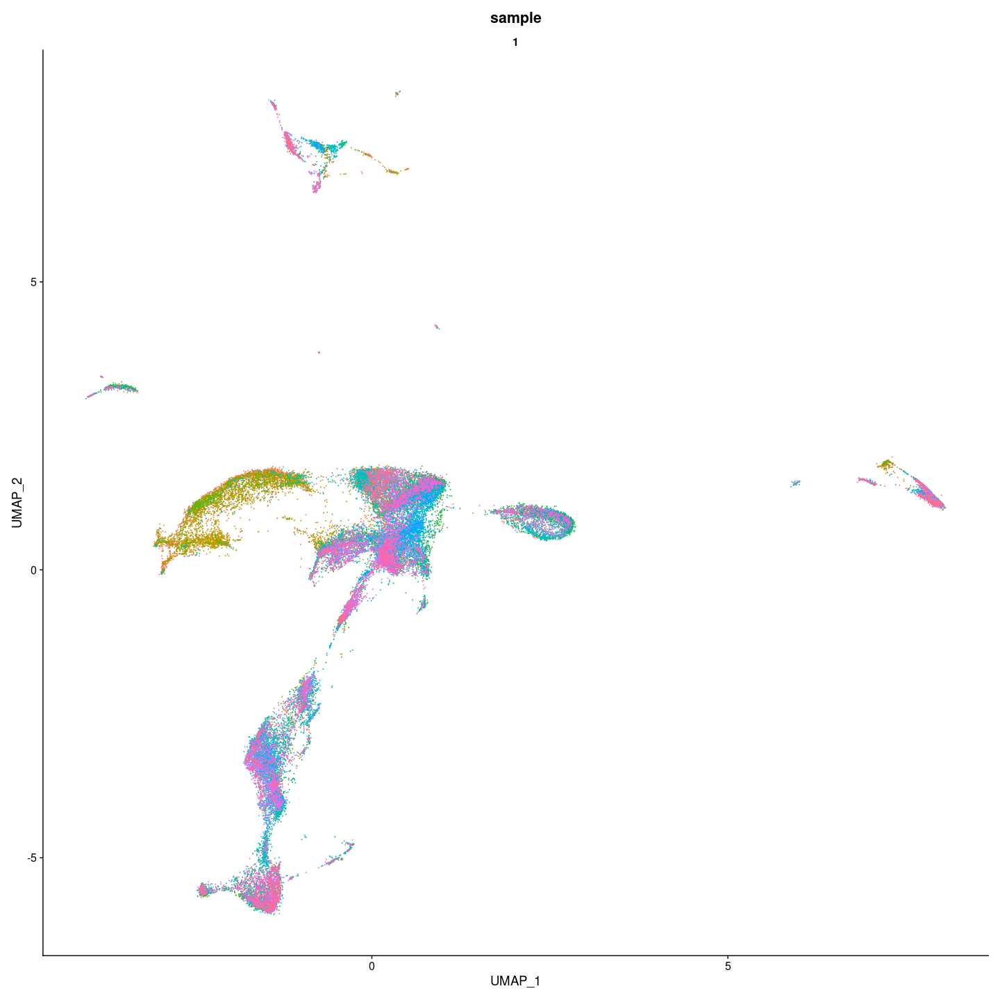
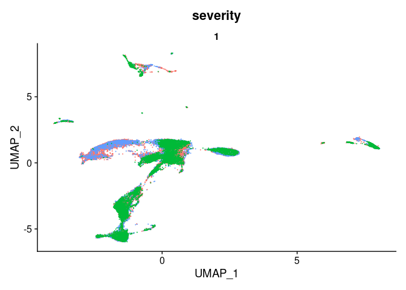
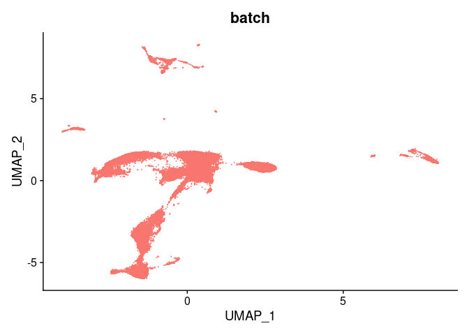

    plot_umap_output <- readRDS(here("data/3_prime_batch_1/preprocessing_results/evaluation_sample_technical_variability/plot_umap_output.rds"))

    plot_umap_output[[1]]

    plot_umap_output[[2]]

    plot_umap_output[[3]]

